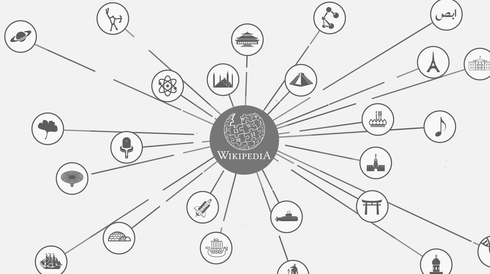

# AMD HOMEWORK 5 - GROUP 29
## Visit the Wikipedia hyperlinks graph!
  

  
**Our team**: Elena lavinia Diaconu, Giulia Scikibu Maravalli, Hassan Ismail.  

The homework consists in ranking Wikipedia articles and their categories according to some criteria.

### Downloads
The files we used to complete our analysis:
- [wiki-topcats-reduced.txt](https://drive.google.com/file/d/1ghPJ4g6XMCUDFQ2JPqAVveLyytG8gBfL/view)
- [wiki-topcats-categories.txt](https://snap.stanford.edu/data/wiki-topcats.html)
- [wiki-topcats-page-names.txt](https://snap.stanford.edu/data/wiki-topcats.html)

## Script Description:
- `Homework_5.ipynb`:  
The script with the code for our analysis.

- `functions.py`:   
Function we used for our analysis.

- `files`:  
During our analysis, we save same of the results in .txt files. This folder includes all of them. Insted of runnig our code, it is possible to check the correctness of our outputs, opening those files.
